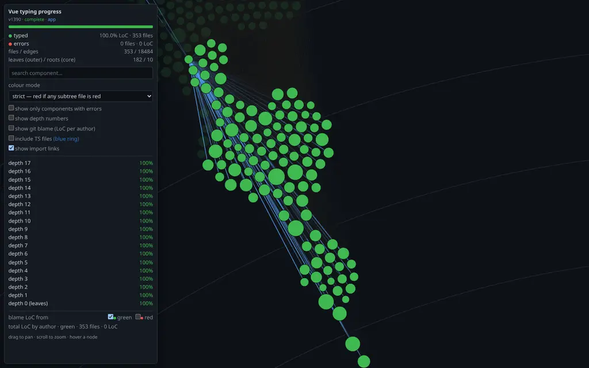
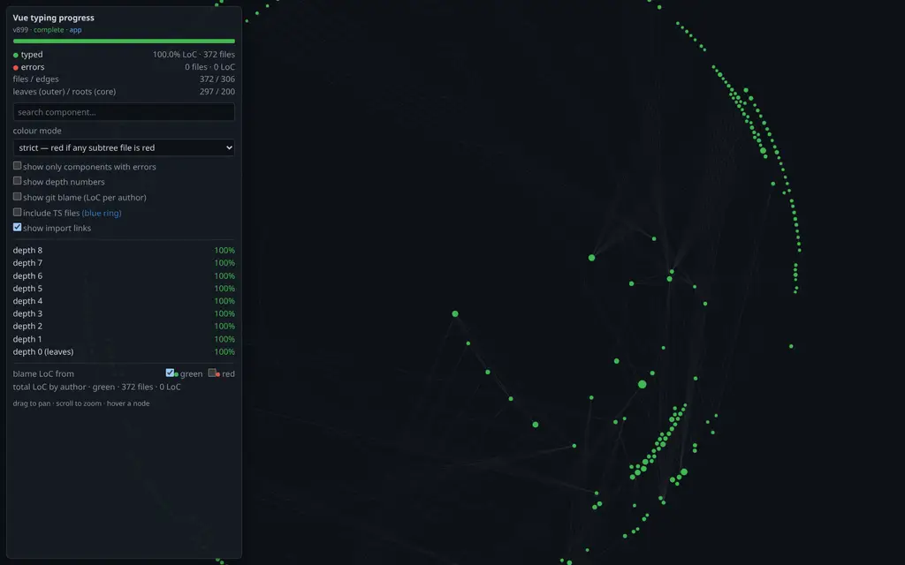

# vite-plugin-tsmigrate

[](https://github.com/web-dev-sam/vite-plugin-tsmigrate/actions/workflows/test.yml)

A **Vite 8** dev-tool plugin that visualises a Vue app's **TypeScript
migration progress**. During dev it hosts its **own Vue app** on a separate
port that crawls your component/module import graph and renders it as an
interactive d3 radial graph — every file coloured by its `vue-tsc` type
status (green = typed, red = has or aggregates errors), sized by lines of
code, with optional per-author `git blame`. A devtool in the spirit of
vite-plugin-inspect and vue-devtools.

Scaffolded and maintained with [Vite+](https://viteplus.dev) (`vp`).

## Install

```bash
pnpm add -D vite-plugin-tsmigrate
# npm i -D vite-plugin-tsmigrate  ·  yarn add -D vite-plugin-tsmigrate
```

Requires `vite@^8` as a peer dependency.

## Usage

Add the plugin to your Vite config:

```ts
// vite.config.ts
import { defineConfig } from "vite";
import { tsmigrate } from "vite-plugin-tsmigrate";

export default defineConfig({
  plugins: [tsmigrate()],
});
```

Start your dev server as usual (`pnpm dev`) and open the **tsmigrate** URL the
plugin prints next to Vite's:

```
  ➜  Local:      http://localhost:5173/
  ➜  tsmigrate:  http://localhost:7357/
```

That page renders your app's component/module import graph as an interactive
radial map, each file coloured by its `vue-tsc` type status — so you can watch a
JavaScript → TypeScript migration turn from red to green, spot the files still
blocking it, and see how much code (and whose) each one carries.

By default the plugin runs `vue-tsc` for you. Point `typeCheckCommand` at your
project's own checker (or set it to `false` to skip the type pass), and turn on
`blame` to attribute lines per author:

```ts
tsmigrate({
  typeCheckCommand: ["vue-tsc", "--noEmit", "--pretty", "false"],
  blame: true,
});
```

## Options

| Option             | Type                     | Default                                        | Description                                                                                                                                                                                                                                           |
| ------------------ | ------------------------ | ---------------------------------------------- | ----------------------------------------------------------------------------------------------------------------------------------------------------------------------------------------------------------------------------------------------------- |
| `typeCheckCommand` | `string[] \| false`      | `["vue-tsc", "--noEmit", "--pretty", "false"]` | Command run once for the project-wide type-check whose per-file error counts colour the graph. Must emit `tsc`-style `--pretty false` diagnostics. `false` skips the pass (every file shows as typed).                                                |
| `scoreTypeRisk`    | `boolean`                | `true`                                         | Let type errors affect the score: files with type errors pay full price for their structural problems, typed files pay only a fraction (the compiler re-checks them for you). `false` scores the structure as if the migration were already finished. |
| `churn`            | `boolean`                | `true`                                         | Measure how change-prone each file is from real git history (one `git log` per repo involved, submodules included). Without usable history — e.g. a shallow clone — the score falls back to an estimate from the import structure.                    |
| `blame`            | `boolean`                | `false`                                        | Enable per-file `git blame` (LoC per author) in the tool. Needs real commit history — a shallow clone has none.                                                                                                                                       |
| `blameAliases`     | `Record<string, string>` | `{}`                                           | Map raw `git blame` author names to canonical display names (line counts merge). Only used when `blame` is on.                                                                                                                                        |
| `toolPort`         | `number`                 | `7357`                                         | Port for the plugin's own tool server (dev only); falls back to an ephemeral port when taken.                                                                                                                                                         |
| `logOnStart`       | `boolean`                | `true`                                         | Log the tool URL when the dev server starts.                                                                                                                                                                                                          |

## Maintainability score

Alongside the graph the tool computes a single **maintainability score**
(capped at 100, open below zero; higher is better), shown at the top of the
panel and served on `GET /api/graph`.

It puts a number on a question you already know by feel: **"if I touch this
file, how bad will it be?"** Before changing a file you have to read it and
understand what it imports. After changing it you have to worry about every
file that imports it, directly or indirectly. Dense `if`/`v-if` logic makes
both steps harder — and wherever TypeScript is in place, the compiler quietly
does a large part of that re-checking for you. The score adds all of this up
as if it were extra lines you had to read, then compares the total against
the size of the codebase itself.

Each file $m$ costs its own lines of code — you have to read it — plus three
overheads, in the same "lines to read" currency:

```math
\mathrm{cost}(m) = \mathrm{loc}(m) + t(m)\cdot\bigl(\mathrm{comp}(m) + \mathrm{mass}(m)\bigr) + \bigl(D + (1{-}D)\,u_{\text{dep}}(m)\bigr)\cdot\mathrm{blast}(m)
```

- $\mathrm{comp}(m) = \mathrm{loc}\cdot\alpha\max(0, C_e^{w}{-}K)$ — **imports
  too much unstable stuff.** Every import is priced by how often its target
  actually changes: importing a constants file or an icon barrel is nearly
  free, importing a file that gets edited every week costs a full point. The
  first $K = 8$ points of import weight are free — ordinary modularity costs
  nothing; only the excess makes a file harder to understand.
- $\mathrm{blast}(m) = \mathrm{loc}\cdot\beta\,\mathrm{vol}\,r$ — **how far a
  change ripples.** $\mathrm{vol}$ is how change-prone the file is, measured
  from git history as deleted lines per month relative to file size (a file
  that only ever _grows_, like a translations file, reads calm; with no
  usable history the tool estimates from the import structure instead). $r$
  is the share of the codebase that imports this file, directly or
  indirectly. A utility hub that half the app depends on _and_ that changes
  weekly is the most expensive thing you can own. Files locked in an import
  cycle count as one blob — each member carries the whole cycle.
- $\mathrm{mass}(m) = \kappa\,\mathrm{cc}\,(\mathrm{loc}/L_0)^p$ — **big
  files full of branches.** $\mathrm{cc}$ counts decision points in
  `<script>` (`if`, `&&`, ternaries, loops) _and_ in `<template>`
  (`v-if`/`v-else-if`/`v-for`/`v-show`). Each branch costs more the bigger
  the file it is buried in, so splitting a 900-line god component genuinely
  lowers the score — while a long but _flat_ file (a route table, plain data)
  costs nothing.
- $t(m)$ and $u_{\text{dep}}(m)$ — **the TypeScript discount** ($D = 0.2$).
  Typed files pay only 20% for their own coupling and branching — the
  compiler carries the rest; files with type errors pay full price. The
  ripple cost is likewise discounted by how typed the _dependents_ are
  ($u_{\text{dep}}$ = the untyped share of the code depending on this file).
  Types only ever make things cheaper: a file with type errors but no
  structural problems costs nothing extra.

Summing every file's overhead and dividing by the codebase size gives Ω —
"how much extra does this codebase cost on top of just reading it once?"
(Ω = 0.5 means 50% extra). Points come from comparing Ω against a fixed
real-world anchor, not against other repos:

$$\Omega = \frac{\sum_m \mathrm{cost}(m) - \sum_m \mathrm{loc}(m)}{\sum_m \mathrm{loc}(m)}, \qquad \text{score} = \min\Bigl(100,\; 30 - 25\log_2 \tfrac{\Omega}{\Omega_{\text{typ}}}\Bigr)$$

$\Omega_{\text{typ}} = 0.10$ is the measured overhead of a **typical
production Vue app**, pinned to score **30** — deliberately not a passing
grade. Halve the overhead and you gain 25 points; double it and you lose 25.
In practice: 100 means changes stay small and local, ~60 is a disciplined
codebase, 30 is the app you probably work on, and below 0 is reserved for
genuine disasters.

The panel breaks the number down so you can act on it: which of the three
overheads dominates (the drivers), the most expensive files (hotspots — start
there), import cycles with the cheapest edge to cut, how much of your code
the git-history measurement actually covers, the typed %, and how much of the
repo the graph can see at all.

The full model — every term, why it is there, the tunable constants, and the
limits of what an import graph can measure — is documented in
[`docs/maintainability-score.md`](./docs/maintainability-score.md).

## Development

This project uses the [Vite+](https://viteplus.dev) toolchain — a single `vp`
CLI wrapping Vite, Rolldown, Vitest, tsdown, Oxlint, and Oxfmt.

```bash
vp install    # install dependencies (workspace: plugin + tool + playgrounds)
vp test       # run the test suite (Vitest)
vp check      # format + lint + type-check
vp run build  # bundle the plugin (tsdown) + build the tool UI to dist/client
```

### The tool dev loop

One command runs everything you need to iterate on the tool UI or the plugin:

```bash
pnpm dev:tool   # or: node scripts/dev.mjs
```

It starts two long-lived servers and keeps them alive (restarting either if it
crashes, both torn down on Ctrl-C):

- **app** — a playground dev server (default `playground`; override with
  `TSMIGRATE_PLAYGROUND=playground-vuetify`). It loads the plugin from source,
  so the plugin serves its JSON API on `:7357`.
- **tool** — the tool UI on `http://localhost:7358` with hot reload, proxying
  `/api` to `:7357`.

Then just edit and watch:

- **Edit `tool/**`** → live HMR at `:7358`. No rebuild.
- **Edit `src/**`** → the app's Vite server auto-restarts (the config imports
  the plugin from source); the plugin reclaims `:7357` and the tool reconnects
  on its next poll. No manual restart.

`dist/client` is only the _shipped_ bundle for the no-HMR path (the plugin
serving its own prebuilt UI on `:7357`); rebuild it with `vp run build` when
you want to verify that path. VSCode users get the same via the `Dev + Tool UI
(HMR)` task in `.vscode/tasks.json`.

## Playgrounds

Three real-world targets exercise the crawl, each vendored as a git submodule
that consumes the plugin from source (`../src/index.ts`) and is analysed by
running `vp dev` in its directory.

### `playground/` — vue-vben-admin (a real app, live type-check)



_`web-antd`'s full module graph — 719 nodes / 2,177 edges, all green (fully typed), scoring **73/100**. Most of its overhead comes from widely-imported files that still change often, plus a few big branchy components; 84% of the code has real git history behind that measurement. Node size ∝ LoC; edges are import relations._

`playground/` is a **complex, real-world app**: [vue-vben-admin](https://github.com/vbenjs/vue-vben-admin)'s
`web-antd` admin — a Vue 3 + TypeScript monorepo (~700 `.vue` + ~700 `.ts`
across the app shell and its `@vben/*` / `@vben-core/*` packages) — vendored as
a git submodule under `playground/vben`. It consumes the plugin from source
(`../src/index.ts`). The entry (`src/main.ts`) imports web-antd's own entry, and
`vite.config.ts` maps vben's workspace aliases (`#/*`, `@vben/*`, `@vben-core/*`)
to package **source**, so the tsmigrate crawl fans out across the real module
graph without a monorepo build.

```bash
git submodule update --init --depth 1 playground/vben   # fetch vben
cd playground/vben && pnpm install                       # deps for the type-check pass
cd .. && vp dev   # dev server — the tsmigrate tool URL is appended to Vite's output
```

Notes specific to this playground:

- **The type-check is real**: `typeCheckCommand` runs vben's own `vue-tsc` over
  the `web-antd` app, and the per-file error counts drive node coloring. A clean
  vben checkout is fully typed, so every node reads green (`100% typed`) —
  introduce a type error in `vben/apps/web-antd/src` to watch a node, and its
  importers, turn red. The pass needs the submodule's `node_modules` (the
  `pnpm install` above); without them the tool surfaces a type-check error and
  nodes fall back to green.
- **The analyzer is Vue-version-agnostic** — Vue 2 and Vue 3 alike. It reads SFC
  `<script>` blocks and import specifiers statically and never compiles
  components, so the Vue version is irrelevant to the crawl.
- **git blame is unavailable here**: a shallow submodule has no line history to
  attribute, so the author rollup is empty. Blame is exercised by the tests.

### `playground-vuetify/` — Vuetify (a component library)


_`packages/vuetify/src` — 524 TypeScript modules (blue TS rings), a fully-migrated component library scoring **60/100**. Hovering `helpers.ts` shows why: 863 lines that 200 modules consume — when it changes (and git history says it does), 88% of the library needs re-checking._

`playground-vuetify/` vendors the **Vuetify monorepo itself**
([`vuetifyjs/vuetify`](https://github.com/vuetifyjs/vuetify)) as a git submodule
under `playground-vuetify/vuetify`. Unlike vben (an app), this is a component
_library_: the crawl seeds from Vuetify's own bundler entry and fans out across
**~520 modules** — every component (`.tsx`), composable, directive and blueprint
under `packages/vuetify/src`, resolved to source via the `@/` alias (no Vuetify
build required).

```bash
git submodule update --init --depth 1 playground-vuetify/vuetify   # fetch Vuetify
cd playground-vuetify/vuetify && pnpm install                       # deps for the type-check
cd .. && vp dev   # dev server — the tsmigrate tool URL is appended to Vite's output
```

Notes specific to this playground:

- **It's `.tsx`, not `.vue`**: Vuetify authors components as `.tsx`, so the
  component graph lives in the module (TS) view — the tool auto-selects "include
  TS files" when a project has no `.vue` nodes. Blue rings mark TS modules.
- **The type-check is real** — it runs Vuetify's own `vue-tsc` over
  `packages/vuetify` (install the submodule's deps first: `cd
playground-vuetify/vuetify && pnpm install`). Vuetify's committed ambient
  `.d.ts` shim sass and build globals like `__VUETIFY_VERSION__`, so the pass is
  accurate, not spurious. Vuetify is **fully migrated to TypeScript**, so a
  clean checkout reports zero errors → every node is green. Introduce a type
  error in a `packages/vuetify/src` module to watch it — and every module that
  imports it — turn red (a bad type in a foundational composable reddens 100+
  nodes). To visualise an _in-progress_ migration (red turning green as code is
  typed), point the type-check at a codebase that still has untyped modules.

### `playground-shadcn/` — shadcn-vue (a component registry)



_The shadcn-vue registry — 448 components that barely import each other, sitting on the outer (leaf) rim of the radial layout and scoring **98/100**: changes stay local, and every depth row is 100% typed._

`playground-shadcn/` vendors the **shadcn-vue monorepo**
([`unovue/shadcn-vue`](https://github.com/unovue/shadcn-vue)) as a git submodule
under `playground-shadcn/shadcn-vue`. The analysed codebase is its component
registry (`apps/v4/registry/new-york-v4`): the entry imports all **66 UI
component barrels**, so the crawl fans out across **~370 `.vue` components** plus
their shared `.ts` helpers (~450 nodes / ~880 edges), resolved to source via
shadcn-vue's `@/` alias (no build required).

```bash
git submodule update --init --depth 1 playground-shadcn/shadcn-vue   # fetch shadcn-vue
cd playground-shadcn && vp dev   # dev server — the tsmigrate tool URL is appended to Vite's output
```

Note: shadcn-vue's registry is a Nuxt app whose type-check relies on Nuxt's
generated tsconfig and auto-imports, so a standalone `vue-tsc` isn't wired here;
the type pass is left off and the crawl maps the real component graph + LoC.
The vben and Vuetify playgrounds run a live `vue-tsc` pass.

During dev the plugin hosts **its own Vue app** — the tool UI in `tool/`,
prebuilt into `dist/client` and shipped with the package — on a separate port,
unrelated to the app server. The tool analyses the user's app and shows every
component with its file path, LoC, and git blame (lines per author), plus the
component import graph rendered as a d3 radial view. Data flows over a small
JSON API: `GET /api/graph` (progressive results while analyzers run; cheap
`?since=<version>` probes once complete) and `GET /api/diagnostics`. Its URL is
appended to Vite's block, styled exactly like Vite's output (green `➜`, cyan
URL, via picocolors — Vite's own color lib):

```
  ➜  Local:   http://localhost:5173/
  ➜  tsmigrate: http://localhost:7357/
```

The tool shuts down with the dev server. To iterate on `tool/` with hot reload
(no rebuild), use `pnpm dev:tool` — see [The tool dev loop](#the-tool-dev-loop).
VSCode users: run the `Dev + Tool UI (HMR)` task from `.vscode/tasks.json`.

## License

[MIT](./LICENSE)
