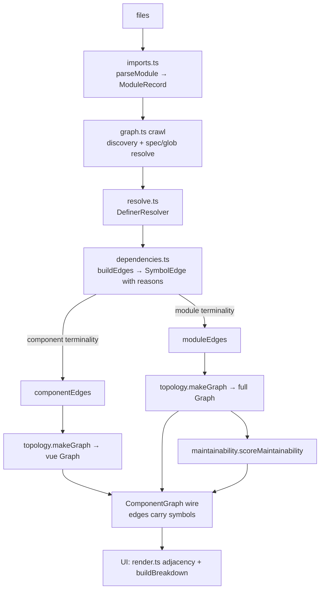

# Symbol-resolved dependency graph

Status: **implemented** (steps 1–6, incl. Phase 5 namespace narrowing and the
Phase 6 score projections). Owner: analysis pipeline. Recorded before/after
scores live in `docs/maintainability-score.md`; capture harness:
`node scripts/score.mjs`.

This document specifies moving the tool's dependency graph and maintainability
score from **file-level** import edges to **symbol-level** ("definition") edges,
and the implementation structure to get there. The goal is accuracy: a file
should depend on another only for the symbols it actually uses, so barrels and
re-export hubs stop inflating fan-out, instability and blast radius.

---

## 1. Motivation

Today two graphs are induced from the same crawl (`src/analysis/engine.ts`):

- `vue` — `.vue` nodes, edges already **symbol-resolved to components**
  (`resolveExport`/`resolveModule` collapse barrels, `graph.ts`).
- `full` — every reachable module, edges are **raw file→file imports**
  (`rawEdges`, `graph.ts:445-473`).

`scoreMaintainability` runs on `full` (`engine.ts:149`). Because `full` uses raw
file edges, a barrel is a false hub:

```
import { Sidebar } from "@/registry/.../sidebar"   // one symbol
```

produces `main → sidebar/index.ts → { Sidebar.vue, + 23 other components }`. The
importer transitively "depends on" 24 components it never touched, and the barrel
looks maximally coupled. Symbol resolution yields `main → Sidebar.vue` only.

The parser **already extracts every symbol** needed for this
(`ImportRef.bindings`, `ExportRef`; `src/analysis/imports.ts`). The `vue` graph
**already resolves through barrels**. This work generalizes that machinery to the
`full` graph and the score, and records per-edge provenance so the UI can explain
_why_ a dependency exists.

Two more consequences of the same change:

- **Red propagation gets truthful.** `strictRed` (`topology.ts`) marks a file
  red when anything it transitively imports is red. On raw edges, one red
  component reddens every consumer of its barrel — for _any_ symbol. On
  definition edges, only actual users redden.
- **Non-goal: intra-file granularity.** A 600-line grab-bag `utils.ts` still
  receives file-level blast from importers of any one of its symbols. At file
  granularity that cost is real (low cohesion), and the per-edge `symbols`
  provenance added here is exactly the input a future per-symbol blast /
  cohesion signal ("split this file") needs. Out of scope for this work.

---

## 2. Dependency semantics

An import contributes a dependency classified by one of these reasons. Only
`value`/`type` are symbol-narrowed; the rest are safe whole-module
over-approximations.

| Source form                              | Reason                                              | Narrowed to symbols?                                                                               |
| ---------------------------------------- | --------------------------------------------------- | -------------------------------------------------------------------------------------------------- |
| `import { X }`, `import X` (default)     | `value`                                             | **yes** — X's definer(s) through re-exports                                                        |
| `import { type X }`, `import type { X }` | `type`                                              | yes (rendered dashed; Phase 6 drops type-only edges from the score's structural terms — see below) |
| `export { X } from "s"`                  | `value`/`type`                                      | yes — X's definer (barrel transparent); the barrel itself value-depends on the definer             |
| `export * from "s"`                      | `value`/`type`                                      | yes — resolved **per name** (`resolveExport` star-forwarding)                                      |
| `import * as ns from "s"`                | `whole` (`namespaceImport`) → narrowable in Phase 5 | partial (see §5)                                                                                   |
| `export * as ns from "s"`                | `whole` (`namespaceReexport`)                       | no (deferred)                                                                                      |
| `import "s"` (side-effect)               | `whole` (`sideEffect`)                              | no — running the module is a real dependency                                                       |
| `import("s")`, `import.meta.glob`        | `whole` (`dynamicImport`)                           | no — symbol unknown at parse time                                                                  |

**Design principle.** Whole-module is an over-approximation: it may add an edge
that isn't strictly used, but never misses one. Narrowing risks the opposite —
_missing_ an edge → an artificially low blast radius, which in a maintainability
tool is the dangerous direction (false confidence). **Narrow only when provably
safe; otherwise keep whole-module.**

### Edge target: expansion vs. the module itself

Symbol-narrowed reasons (`value`/`type`) point at the **definer set** in both
graphs. Whole-module reasons differ **per graph**:

- **Component graph** — expand via `ofModule` to the components the module
  surfaces (today's behavior; `.ts` files are not nodes there, so expansion is
  the only option).
- **Module graph** — a `whole` reason emits exactly **one edge to the module
  itself** (`from → m`), never an expansion. Reachability (and therefore blast
  radius) stays over-approximated through `m`'s own outgoing edges, but no
  direct fan-out is fabricated. Concretely: `playground-shadcn`'s entry is 66
  side-effect barrel imports (`src/main.ts`); expansion would hand it ~370
  direct edges — fabricated comprehension cost and exactly the rendered
  clutter this work removes. It keeps 66, as today. This rule also makes
  Phase 5 a pure precision win instead of a regression fix.

### Fallback: resolution must never lose an edge

`ofExport` can come back empty for a dependency that is real at runtime:

- a re-export chain that leaves the project (`export { useQuery } from
"@tanstack/vue-query"` in a barrel — external targets resolve to `null` and
  the chain dies),
- an unparseable or unreadable module (empty `ModuleRecord`),
- a name that isn't found (typo, ambient/global).

ESM executes the imported module in every one of those cases, so in the module
graph an **empty resolution set falls back to a whole-module edge to the
direct target**, cause `unresolvable` — the edge is never dropped. (The `vue`
graph keeps today's behavior: there an empty set legitimately means "not a
component".) This is the design principle above made mechanical: narrowing may
only ever shrink an edge's target set to provably-used definers, never to ∅.

### Score projections by edge kind (Phase 6)

`scoreMaintainability` currently treats every edge identically — type-only and
lazy edges count fully toward fan-out, fan-in, instability and blast radius.
Both over-attribute, each in its own way, and one mechanism fixes both: the
score reads a **projection** of the edges, selected per term by the edge's
reasons.

- **Type-only edges** (every reason `type`): a type-only dependent is
  re-verified by the **compiler**, not by a human re-reasoning about behavior.
  Excluded from the structural terms (`Ce^w`, `Ca`, `I`, and the blast-term
  `r`); included in the **type-risk radius** (the `r` in `γ·(1 + δ·r)`) — a
  broken type propagates to precisely its type-dependents, which is what
  `strictRed` already models.
- **Lazy edges** (`whole`/`dynamicImport`, incl. `import.meta.glob`): the
  standard Vue lazy-route / auto-registration pattern. A route table globbing
  200 pages is a declarative registry, not comprehension load — but today it
  blows past `K` and becomes the #1 "excess coupling" hotspot, telling the
  user to "fix" their router. Excluded from the **importer's** `Ce^w` (and so
  from its instability numerator); kept everywhere else — the targets' `Ca`,
  reachability and blast radius are unchanged, because a broken page still
  breaks navigation. Synchronous side-effect imports stay fully counted: they
  execute at module load and are real comprehension load.
- Everything else is fully counted. Structural blast reachability runs on all
  value edges (sync + lazy); the type-risk radius on all edges. At most two
  extra bitset reachability passes — cheap at this scale.
- Steps 1–3 ship with today's semantics (every edge counts everywhere), so
  the shift from symbol narrowing is measured in isolation; Phase 6 lands as
  its own recorded before/after.

---

## 3. What changes vs. stays

Stays: LoC weighting, the maintainability formulas (`maintainability.ts` — the
term structure is untouched; steps 1–3 change only edge _quality_, Phase 6
changes only which edges feed which term, per §2), cycle handling, type-only
stickiness, the `vue` graph's observable behavior.

Changes:

- `full`-graph edges become symbol-resolved definition edges; whole-module
  dependencies stay a single edge to the module itself (§2).
- `ComponentEdge` gains optional provenance (`symbols`, later `via`).
- `strictRed` on the full graph stops reddening consumers through barrels they
  use only for unrelated symbols.
- The score moves **in both directions** — the goal is accuracy, not a higher
  number. Definers' blast radius and barrels' fan-in collapse (up); fan-out
  that barrels used to hide surfaces at real consumers (down where it exceeds
  the budget `K`). Documented before/after in `docs/maintainability-score.md`.

---

## 4. Domain model (Rust-style)

Modeled as exhaustive tagged unions with a compile-time `assertNever`, small
pure modules, and explicit types at every seam. Internal analysis types (not the
wire) live in a new `src/analysis/symbols.ts`.

```ts
// src/analysis/symbols.ts — domain vocabulary, no IO.

/** Absolute module id (as produced by the resolver). Alias for intent. */
export type ModuleId = string;
/** An export name, or the literal "default". */
export type SymbolName = string;

/** What counts as a "definition" in a given graph view. */
export interface Terminality {
  /** `.vue` files are always terminal definers (their default component). */
  readonly isComponent: (mod: ModuleId) => boolean;
  /** Do locally-declared `.ts` exports count as definers?
   *  module graph: true; component (vue) graph: false. */
  readonly localsAreDefiners: boolean;
}

/** Why a dependency could not be narrowed to specific symbols.
 *  Each variant NAMES a specific cause so results are explainable and the
 *  known blind spots are greppable in code. */
export type WholeModuleCause =
  | "sideEffect" // import "x"
  | "namespaceImport" // import * as ns  (pre-Phase-5, or non-narrowable)
  | "namespaceReexport" // export * as ns
  | "dynamicImport" // import(...) / import.meta.glob
  | "unresolvable" // empty resolution: re-export chain exits the
  //   project, unparseable module, or missing name —
  //   fall back to the direct target, never drop (§2)
  | "namespaceEscape" // Phase 5: ns used as a value / spread / dynamic key
  | "namespaceShadowed" // Phase 5: the local ns name is shadowed in scope
  | "sfcTemplateBlindSpot"; // Phase 5: .vue namespace usage is invisible — the
// crawl parses <script> only, never <template>, so a
// namespace used only in the template can't be seen;
// we conservatively keep the whole-module edge.

/** Why `from` depends on `to`, most precise first. */
export type DependencyReason =
  | { readonly tag: "value"; readonly symbols: readonly SymbolName[] }
  | { readonly tag: "type"; readonly symbols: readonly SymbolName[] }
  | { readonly tag: "whole"; readonly cause: WholeModuleCause };

/** An internal, provenance-rich edge. Merged to the wire `ComponentEdge` at the
 *  topology boundary. `from`/`to` deduped; `reasons` accumulated. */
export interface SymbolEdge {
  readonly from: ModuleId;
  readonly to: ModuleId;
  readonly reasons: readonly DependencyReason[];
}

export function assertNever(x: never): never {
  throw new Error(`unhandled variant: ${JSON.stringify(x)}`);
}
```

The caveat the product owner accepted is the **`sfcTemplateBlindSpot`** variant —
it is a first-class, named value in the domain, not a buried comment.

### Wire additions (`src/shared/types.ts`)

```ts
export interface ComponentEdge {
  from: string;
  to: string;
  type?: boolean;
  /** Origin symbol names crossing this edge (capped; empty for whole-module). */
  symbols?: string[];
  /** Re-export/barrel hops the resolution passed through. First hop ships in
   *  step 2 (free at edge-build time); the full chain is Phase ≥2. */
  via?: string[];
}
```

An edge's wire fields derive from its `reasons`:
`type` = every reason is `type`; `symbols` = union of `value`+`type` symbols
(capped, `+N` elided in UI); whole-module reasons contribute no symbols.

---

## 5. Namespace precision pass (Phase 5, optional)

`import * as ns from "s"` binds an object; the dependency is decided by **usage**
(`ns.Home`), not the import statement. `parseModule` currently keeps only the oxc
module record and discards the AST body, so this needs new machinery:

- Extend the record with `NamespaceUsage { local, source, members | null, cause }`.
- `collectNamespaceUsage(program)`: walk the body, collect static member reads
  (`ns.X`, `ns?.X`, `ns["X"]`) on the namespace local.
- Fall back to whole-module (`members = null`, with the matching
  `WholeModuleCause`) on **any escape**: bare use `f(ns)`/`return ns`, spread
  `{...ns}`, enumeration (`Object.keys(ns)`, `for (const k in ns)`), dynamic
  key `ns[expr]`, rest destructure `const {a, ...rest} = ns`, re-export of the
  local (`export { ns }` / `export default ns`), or a shadowed local.
- For `.vue` files, do **not** attempt narrowing → `cause: "sfcTemplateBlindSpot"`
  (the crawl never sees `<template>`).

`export * as ns` (namespace re-export) requires tracing the namespace object into
each consumer — deferred, stays whole-module (`namespaceReexport`).

---

## 6. Module structure

Rust-crate-like separation — parse / domain / resolve / classify / crawl /
topology / score, each a focused unit with typed seams:

```
src/analysis/
  imports.ts        parse → ModuleRecord (+ NamespaceUsage in Phase 5). Parsing only.
  symbols.ts   NEW  domain types (§4): ModuleId, SymbolName, Terminality,
                    DependencyReason, WholeModuleCause, SymbolEdge, assertNever.
  resolve.ts   NEW  DefinerResolver — ofExport(mod,name) / ofModule(mod).
                    Pure, memoized, cycle-guarded. Parametrized by Terminality.
                    (Extracted + generalized from graph.ts resolveExport/
                    resolveModule/resolveBinding.)
  dependencies.ts NEW  buildEdges(records, resolver, usage, terminality)
                    → SymbolEdge[]. Owns the reason classification (§2 table),
                    the per-graph whole-module edge target and the
                    `unresolvable` fallback (§2); exhaustive switch over
                    import/export/usage forms.
  graph.ts          crawl/discovery (BFS, specifier + glob resolution). Delegates
                    resolution to resolve.ts and edges to dependencies.ts.
                    Returns CrawlResult { files, componentEdges, moduleEdges }.
  topology.ts       computeHeights + makeGraph. UPDATED to merge/preserve
                    provenance (see §7).
  maintainability.ts consumes edges. No formula change.
  engine.ts         wires: vue = makeGraph(componentEdges),
                    full = makeGraph(moduleEdges); score on full.
```

### DefinerResolver

```ts
export interface DefinerResolver {
  /** Defining modules a named export surfaces to (through re-exports/barrels). */
  ofExport(mod: ModuleId, name: SymbolName): ReadonlySet<ModuleId>;
  /** Defining modules a whole module/namespace surfaces. Used for
   *  component-graph expansion only — module-graph `whole` edges target the
   *  module itself (§2). */
  ofModule(mod: ModuleId): ReadonlySet<ModuleId>;
}

export function makeResolver(
  records: ReadonlyMap<ModuleId, ModuleRecord>,
  resolveSpec: (from: ModuleId, spec: string) => ModuleId | null,
  term: Terminality,
): DefinerResolver;
```

`ofExport` terminality:

- `term.isComponent(mod)` → `{mod}` (a `.vue` default component).
- a `reexport`/`ns`/`star` export → follow to the source (barrel transparent).
- a `local` export → if it re-binds an import, follow that binding; else it is a
  local definition: `{mod}` when `term.localsAreDefiners`, else `∅`
  (the component graph drops `.ts`-defined values — current behavior preserved).

The **component** graph uses `{ isComponent: isVue, localsAreDefiners: false }`
(identical to today); the **module** graph uses
`{ isComponent: isVue, localsAreDefiners: true }`.

### Resolver correctness rules

Rules the extraction MUST carry — the first two are latent in today's
`graph.ts` and become load-bearing once the score consumes the module graph:

- **`export *` never forwards `default`** (ESM semantics). The current star
  fallback (`graph.ts:283-294`) lacks a `name !== "default"` guard;
  `resolve.ts` adds it, with a test.
- **Never memoize a truncated result.** Today a result computed while a cycle
  guard was active is cached (`graph.ts:295-296`), so a `seen`-truncated
  intermediate set can be served later — entry-order-dependent results in
  mutual `export *` cycles. `resolve.ts` tracks whether a computation touched
  an in-progress key and caches only clean results (fallback if ever too
  slow: per-SCC fixpoint — irrelevant at ~1k modules).
- **Barrel fan-in is accepted for now.** A barrel's own `value` edges to its
  definers add one fan-in per barrel to every re-exported module, slightly
  diluting definer instability. The error direction is score-up and the
  magnitude one edge next to the real consumer edges; revisit only alongside
  per-symbol blast.

### Provenance is cheap

Symbols are captured in the same edge-build pass, per binding — no extra
traversal. For a direct edge `from → to`, `symbols` = the local import names in
`from` whose resolution set contains `to`. The first `via` hop is equally free:
the import statement's direct resolved target is already in hand when the
narrowed edge is emitted, so `via: [directTarget]` ships in step 2 whenever it
differs from `to`. Without it a narrowed edge is un-greppable — the graph says
`main → Sidebar.vue` while `main.ts` contains only
`from "@/registry/…/sidebar"`, and the user can't find the line to change. The
full multi-hop chain needs the resolver to thread a path and stays deferred to
Phase ≥2.

---

## 7. Topology change (must not drop provenance)

`makeGraph` (`topology.ts:117-131`) currently rebuilds induced edges as bare
`{from,to,type?}`. Update the merge to also union `symbols` (dedup + cap) and
`via` across duplicate `(from,to)` occurrences, keeping the existing type-only
downgrade rule (a single value occurrence clears `type`).

---

## 8. Data flow



---

## 9. UI — per-dependent path, symbols & edge weight

The original ask ("why does `main` need attention if `Sidebar` changes?") is
served on top of provenance:

- **Path**: client-side BFS shortest path `dependent → … → target` over the
  up-adjacency (edges already client-side; `tool/src/graph/render.ts`).
- **Why**: the `symbols` on the final hop `P → target`.
- **Render** (`NodeDetailPanel.vue`, change-blast list):
  `main → sidebar/index.ts → Sidebar — imports \`Sidebar\``.

Requires threading `symbols` into `RLink` in `render.ts`.

### Visual edge weight (same number the score charges)

Every drawn link is currently uniform (`.link { stroke: #30363d;
stroke-opacity: 0.5 }`, 1px); the only distinctions are binary (`.type`
dashed, `.hl` blue, `.dim` faded). The score, meanwhile, charges each import
by its target's volatility. The render mirrors it — **an edge's visual weight
is the exact number the score charges for it**:

- **Weight**: `w(u → v) = I₀(v)`, computed on the value projection — the same
  `i0Of()` the detail panel already prints as `×0.87` import tails
  (`render.ts`). No wire change; self-consistent per view (vue/full).
- **Channels**: `stroke-opacity = 0.10 + 0.65·w` (primary — "a stable import
  is nearly free" renders as nearly invisible) and `stroke-width =
0.6 + 1.2·w` (secondary pop for heavy edges). No colour ramp: hue already
  means hover-blue on edges and type status on nodes.
- **Type-only edges** are pinned to the floor — after Phase 6 their
  structural charge is exactly 0, and the existing dashes explain why.
- **States**: `.hl` (highlight-links mode) scales too but with a higher floor
  (~0.35) so trace mode stays usable; `.dim` unchanged.
- **Implementation trap**: CSS class rules override SVG presentation
  attributes, so the base `stroke-opacity` moves out of `.link` CSS into the
  per-element attr set in `renderLinks()`; `.hl`/`.dim` then win over the
  attr naturally (CSS > presentation attributes), no `!important`.
- **Effect**: volatile hubs collect converging bold lines; a 500-importer
  icon/constants barrel fades to a whisper without hiding a single real edge.
- **Lazy edges** join the floor after Phase 6 — like type edges they charge no
  comprehension; a distinct dash pattern separates them from type edges.

Ships in step 4 (with or after steps 1–3, never before): weighting today's
raw edges would paint the barrels' _false_ edges boldly — the same reason the
score waits for narrowed input. When Phase 6 lands, the client's `i0Of()`
switches to the value projection alongside the server.

### Actionability contract (everything the score names must be actionable)

Audit findings in the current tool — each leaves the user with a number but no
next step:

- **Hotspot clicks silently no-op in the `vue` view.** The score runs on
  `full`, but the default view is `.vue`-only; `focusDependents()`
  (`render.ts`) returns early when the hotspot id isn't in the scene, and
  driver halos reference invisible `.ts` nodes. Rule: clicking a hotspot or
  driver row **auto-switches `includeTs` on** when the target lives only in
  the module graph — never a silent no-op.
- **The detail panel mixes graphs.** `buildBreakdown()` juxtaposes server
  full-graph numbers (`weightedFanout`, `instability`, `blastRadius`) with
  contributor lists and `×I₀` tails computed from the _current view's_
  adjacency — in the `vue` view they cannot add up. Contributor weights must
  come from a full-graph adjacency built client-side from `graph.full.edges`
  (already on the wire), whatever view is shown.
- **Cycles are flagged, never shown.** `in a cycle` / `cycleLoc` exist, but
  nothing lists the members or where to cut. The server already has the SCCs
  (Tarjan): ship the top cycles by LoC as `maintainability.cycles:
string[][]`; the panel lists them, click isolates the members. Symbol
  provenance gives a cut hint for free — the cycle edge carrying the fewest
  `symbols` is the cheapest to sever.
- **Drivers report shares, not actions.** Each driver + reason pair has a
  mechanical one-liner the panel can emit once reasons/symbols exist:
  comprehension → "imports N volatile modules — invert or split"; blast →
  "volatile and widely imported — stabilize its own imports"; types → "fix
  the N errors here first (widest radius)"; cycle → "break `A → B` (1
  symbol)". Client-side only; no wire change beyond `cycles` above.

---

## 10. Testing & verification

- `tests/analysis.test.ts`: fixtures for barrel pass-through, `export *`,
  default / namespace / side-effect, re-export chains, cycles; assert
  `moduleEdges` point at **definers** (not barrels) and `symbols` is populated.
  Add Phase-5 cases: static member narrowing, each escape → the correct
  `WholeModuleCause`, and `.vue` → `sfcTemplateBlindSpot`.
- Fallback & whole-module fixtures (§2): re-export into `node_modules` →
  `unresolvable` edge to the barrel (not dropped); unparseable / unreadable
  module keeps its importers' edges; side-effect import of an export-less
  module keeps `from → m`; namespace / side-effect / dynamic imports in the
  module graph produce a single `from → m` edge (no expansion).
- Resolver rules (§6): `export *` does not forward `default`; mutual
  `export *` cycles resolve identically regardless of query order (memo
  taint).
- Per-binding type precision: `import { type A, B } from "m"` yields a `type`
  reason to A's definer and a `value` reason to B's definer.
- Lazy projection (§2, Phase 6): a route-table fixture globbing many pages
  gains no comprehension surcharge; the pages' fan-in, reachability and blast
  are unchanged.
- Exhaustiveness enforced at compile time via `assertNever` in every switch.
- Sanity on **all three playgrounds** (shadcn: side-effect barrel entry +
  named imports; vben: deep `@vben/*` barrel layers; vuetify: `export *`
  chains and real cycles): named-import consumers' blast radius drops, barrel
  nodes lose spurious dependents, entry fan-out unchanged, score recorded
  before/after — and again, separately, for Phase 6.
- Edge-weight rendering (§9): drive a playground in the browser — dashed
  type-only edges sit at the floor, lines into a stable barrel/types module
  are faint, lines into a volatile hub are bold; `.hl`/`.dim` still override
  (the CSS-over-attribute rule holds).
- Actionability contract (§9): hotspot click from the `vue` view switches to
  the module view and isolates dependents (never a no-op); breakdown
  contributor weights match the server's `weightedFanout` in both views;
  cycle rows isolate their members.
- Update `docs/maintainability-score.md` with the symbol-level graph, the §2
  table, and the Phase-6 value-projection semantics.

---

## 11. Sequencing

1. **Domain + resolver** — add `symbols.ts`; extract/generalize `resolve.ts`
   with `Terminality` + the correctness rules (§6); keep `vue` graph
   byte-identical (regression gate).
2. **Edges** — `dependencies.ts` `buildEdges`; produce `componentEdges` +
   `moduleEdges` with reasons, the per-graph whole-module target and the
   `unresolvable` fallback (§2); map to wire `ComponentEdge` (+ `symbols`,
   first-hop `via`).
3. **Wire it** — `topology.makeGraph` provenance merge; `engine.ts` full graph on
   `moduleEdges`; confirm score recomputes; update tests + score doc.
4. **UI** — path + symbols in the change-blast list; volatility-weighted edge
   rendering; the actionability contract (§9: view auto-switch, full-graph
   breakdown weights, cycle surfacing + cut hints, per-driver action lines).
5. **Phase 5 (optional)** — namespace precision pass with named
   `WholeModuleCause` fallbacks (incl. `sfcTemplateBlindSpot`).
6. **Phase 6 — score projections** — structural terms on the value
   projection, lazy edges out of `Ce^w`, type-risk radius on the full graph
   (§2); its own recorded before/after on the playgrounds.

Steps 1–3 are the accuracy core; 4 is the actionable-explanation feature; 5
and 6 are independent precision refinements (5 narrows whole-module edges, 6
stops charging comprehension for lazy registries and behavioral blast through
type-only edges). Each step is independently shippable and gated by the
`vue`-graph regression test.

---

## 12. Known blind spot: auto-imports (detect, don't guess)

Nuxt / `unplugin-vue-components` / `unplugin-auto-import` projects use
components and composables with **no import statement at all** — the crawl
sees nothing, edges are silently missing, and blast radius reads artificially
LOW: the dangerous direction (§2's design principle violated by the input,
not the resolver). The shadcn playground's upstream registry is exactly such
a Nuxt app.

Mitigation is detection first, resolution later:

- **Detect** the generated manifests (`.nuxt/components.d.ts`,
  `components.d.ts`, `auto-imports.d.ts`) during the crawl and surface a UI
  banner: "auto-imports detected — bindings invisible to the graph; coupling
  and blast radius are under-reported."
- **Later** (its own project): the manifests map names → modules; combined
  with a template tag scan they would recover the missing edges. Out of scope
  here — it needs `<template>` parsing, which this plan deliberately avoids
  (`sfcTemplateBlindSpot`).
